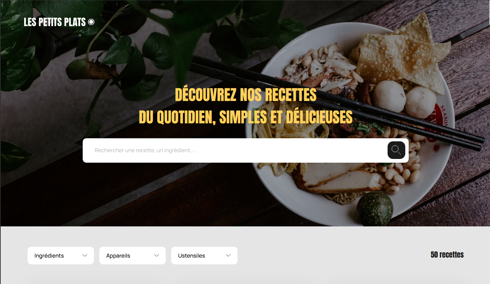

# 🍳 Les Petits Plats – Site de recettes en React / Next.js

Projet de développement Front-End pour l’entreprise **Les Petits Plats**, dans le cadre d’un exercice OpenClassrooms.  
L’objectif : créer un site de recherche de recettes performant et ergonomique à partir d’un jeu de données JSON.

---


<p align="center">
	
</p>

## 🚀 Objectif du projet

Le site **Les Petits Plats** permet d’explorer 50 recettes populaires de cuisine française.  
L’utilisateur peut :
- parcourir la liste complète des recettes ;
- rechercher une recette par **mot-clé** ;
- filtrer par **tags** (ingrédients, appareils, ustensiles) ;
- combiner plusieurs filtres simultanément ;
- retirer un filtre à tout moment pour réactualiser la liste.

---

## 🧩 Technologies utilisées

- **Next.js** (React 18) — structure du projet et routage dynamique ;
- **React Hooks** (`useState`, `useEffect`, `useContext`) — gestion du state et de la logique des filtres ;
- **Context API** — partage global des tags et filtres entre les composants ;
- **CSS Modules** — styles locaux par composant ;
- **JavaScript ES6+** — manipulation des données et algorithmes de filtrage.

---

## ⚙️ Installation et lancement

```
# 1. Cloner le dépôt
git clone https://github.com/votre-compte/les-petits-plats.git
cd les-petits-plats

# 2. Installer les dépendances
npm install

# 3. Lancer le serveur de développement
npm run dev

# Le Le site sera disponible à l’adresse :
👉 http://localhost:3000
```

## 📁 Structure du projet
```
src/
│
├── app/
│   ├── data/
│   │   └── recipes.json       # les 50 recettes au format JSON
│   ├── layout.jsx             # layout global (Header, Footer)
│   ├── page.jsx               # page d'accueil
│   └── [slug]/page.jsx        # page dynamique pour chaque recette
│
├── components/
│   ├── Recipes/
│   │   ├── RecipeCard.jsx     # composant réutilisable pour afficher une recette
│   │   ├── RecipesGrid.jsx    # grille des recettes filtrées
│   │
│   ├── Tags/
│   │   ├── FilterContext.jsx  # logique globale des tags (Context API)
│   │   ├── FiltersBar.jsx     # zone des filtres
│   │   ├── FilterCard.jsx     # carte de tags (ingrédients, ustensiles, appareils)
│   │   └── Tag.jsx            # composant individuel de tag sélectionné
│   │
│   └── UI/
│       ├── SearchBar.jsx      # barre de recherche principale
│       └── ...                # autres composants d’interface
│
└── styles/
    └── *.module.css           # fichiers CSS Modules par composant

```

---

## 🔍 Fonctionnalités principales

### 🔸 Recherche principale

- Permet de rechercher par mot-clé (titre, description, ou ingrédients).
- Utilise un state local + Context (liveQuery) pour filtrer les recettes en temps réel.

### 🔸 Filtres par tags

- Chaque tag est associé à un type : ingredients, appliances, ou ustensils.

- Lorsqu’un tag est sélectionné :
    - il disparaît de la liste des tags disponibles
    - la liste des recettes est automatiquement filtrée
    - les autres listes de tags sont réactualisées pour ne proposer que ceux encore pertinents.

### 🔸 Suppression d’un tag

- Lorsqu’un tag est retiré :

    - il réapparaît dans la liste disponible ;
    -   la liste des recettes se met à jour dynamiquement.

### 🔸 Recherche “live”

- L’utilisateur peut taper un mot-clé (ex. “coco”) :

    - la grille des recettes se met à jour en direct (fonction debounce pour éviter les recalculs trop fréquents) ;
    - s’il valide la recherche (Entrée / clic sur la loupe), un tag “mot-clé” est créé.


## 🧮 Logique du filtrage

Le filtrage est centralisé dans FilterContext.jsx.

### 1. Canonisation des données

Chaque texte (ingrédient, appareil, ustensile, mot-clé) est :

 - passé en minuscules,
 - dépourvu d’accents,
 - singularisé (on supprime le “s” final),
 afin de garantir des comparaisons cohérentes.

### 2. Séparation logique / affichage

- key (forme canonique) sert aux comparaisons
- label (texte original) est affiché à l’écran.

### 3 . Algorithme

Pour chaque recette :

- on construit trois ensembles : ingredients, appliance, ustensils
- on vérifie que chaque tag sélectionné est présent dans la recette

si la recette passe tous les tests, elle est affichée.

## 🧠 Compétences démontrées

- Initialisation d’un projet React / Next.js avec create-next-app.
- Découpage modulaire en composants réutilisables.
- Utilisation de Next.js Routing (pages dynamiques [slug] + not-found.jsx).
- Mise en œuvre de la Context API pour le partage global du state.
- Écriture d’un algorithme de filtrage fidèle aux spécifications.
- Gestion d’une recherche asynchrone débouncée pour un rendu fluide.
- Respect des principes de clean code et d’accessibilité (labels, aria-labels…).